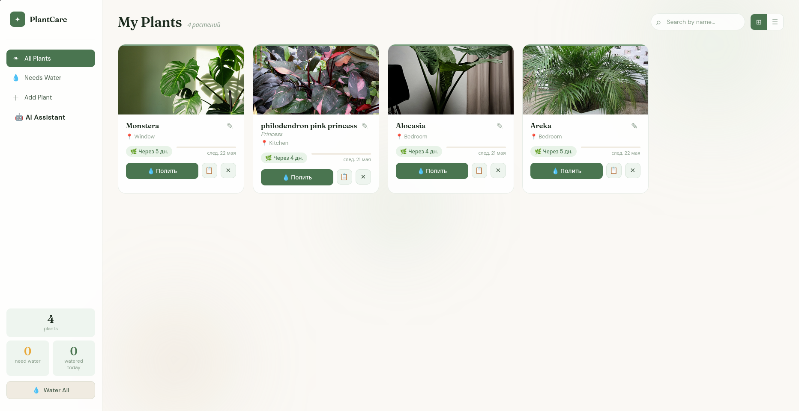
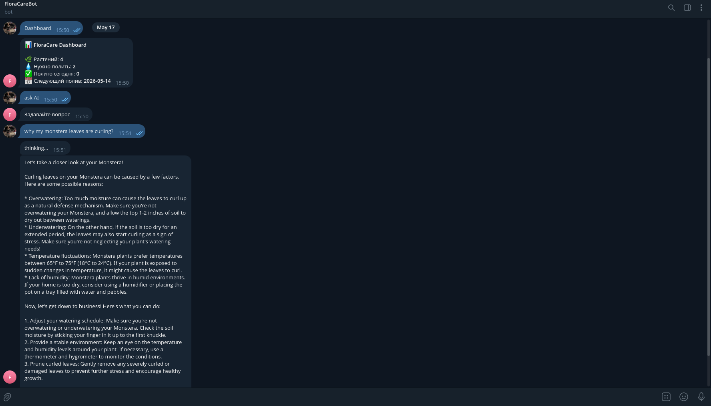
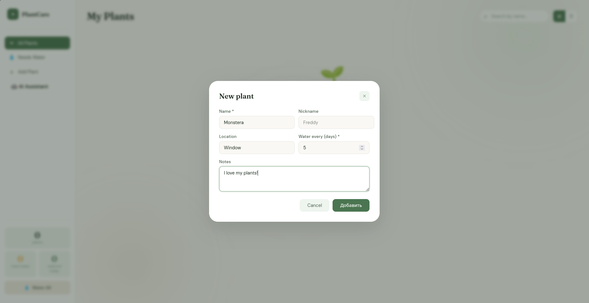
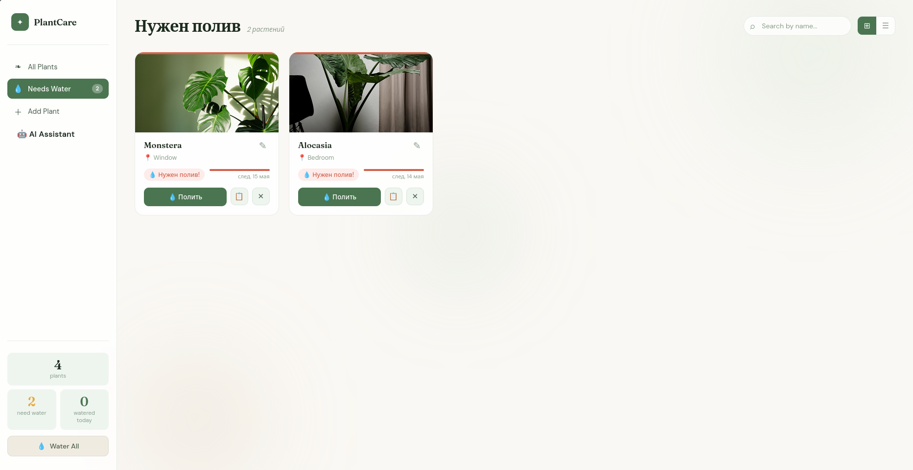
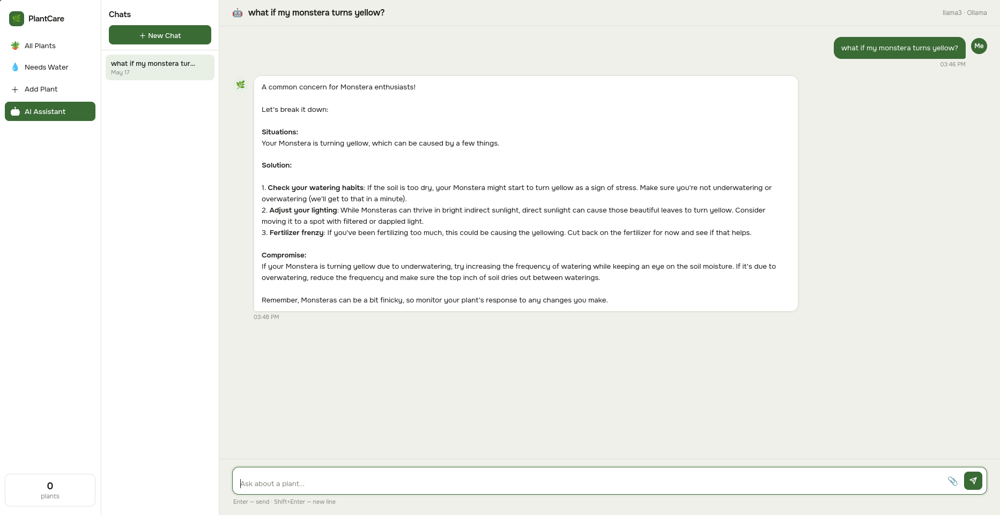

```markdown
# 🌿 FloraCare — Smart Plant Monitoring & AI Diagnostics Ecosystem

FloraCare is a comprehensive full-stack ecosystem designed to automate plant care, monitor health metrics, and diagnose plant diseases using Artificial Intelligence. The project consists of a responsive Web Application and a Telegram Bot companion for instant notifications and quick AI consultations.

## 📸 Interface Preview

<p align="center">
  
  
  
  
  

</p>


---

## ⚠️ Development Status & Disclaimer

> [!WARNING]
> This project is currently under active development. You may encounter minor bugs, unfinished features, or temporary localization/translation issues (mix of English and Ukrainian). We are constantly working on stability improvements, UI polishing, and expanding the AI capabilities.


---

## 🚀 Key Features

### 💻 Web Application (Full-Stack)
*   **Interactive Dashboard:** Monitor plant metrics, history, and schedules in real-time.
*   **Responsive UI:** Clean and modern interface built with semantic HTML5, CSS3, and native JavaScript.
*   **Robust Backend:** High-performance asynchronous API powered by FastAPI.

### 🤖 Telegram Bot Companion
*   **Smart Notifications:** Automated push-notifications to remind you when your plants need attention (watering, feeding, etc.).
*   **AI Disease Recognition:** Upload a photo of a sick plant, and the integrated local AI will detect the disease.
*   **Instant AI Assistant:** Ask text questions about plant care and get immediate, contextual advice on the go.

### ⚙️ Architecture & Data
*   **Relational Database:** Structured data storage for users, plants, metrics, and logs managed via **SQLAlchemy (ORM)**.
*   **Containerized Environment:** Fully dockerized setup for seamless, one-command deployment in any environment.

---

## 🛠️ Tech Stack

*   **Backend:** Python 3.x, FastAPI, Uvicorn, Aiogram
*   **Database & ORM:** SQLAlchemy, SQLite (easily switchable to PostgreSQL)
*   **Frontend:** HTML5, CSS3, JavaScript (Vanilla)
*   **AI Integration:** Local Multimodal AI Models (Image Classification + NLP)
*   **DevOps & Tools:** Docker, Python-Telegram-Bot API


---

## ⚡ Quick Start & Deployment

### Prerequisites

* Docker installed on your system.

### Running with Docker

1. Clone the repository:
```bash
git clone [https://github.com/YanniszY/FloraCare.git](https://github.com/YanniszY/FloraCare.git)
cd FloraCare

```


2. Edit a `.env` file in the root directory and add your credentials:
```env
TELEGRAM_BOT_TOKEN="your_bot_token_here"

```


3. Build and run the Docker container:
```bash
docker compose up --build

```

4. Download model (first time):
```bash
docker compose exec ollama ollama pull llama3

```

5. Open your browser and navigate to `http://localhost:8000` to explore the Web UI.

---

## 🧑‍💻 Author

* **Developer:** YanniszY
* **Role:** Solo Full-Stack Developer & System Architect
* **GitHub:** [@YanniszY](https://www.google.com/search?q=https://github.com/YanniszY)

